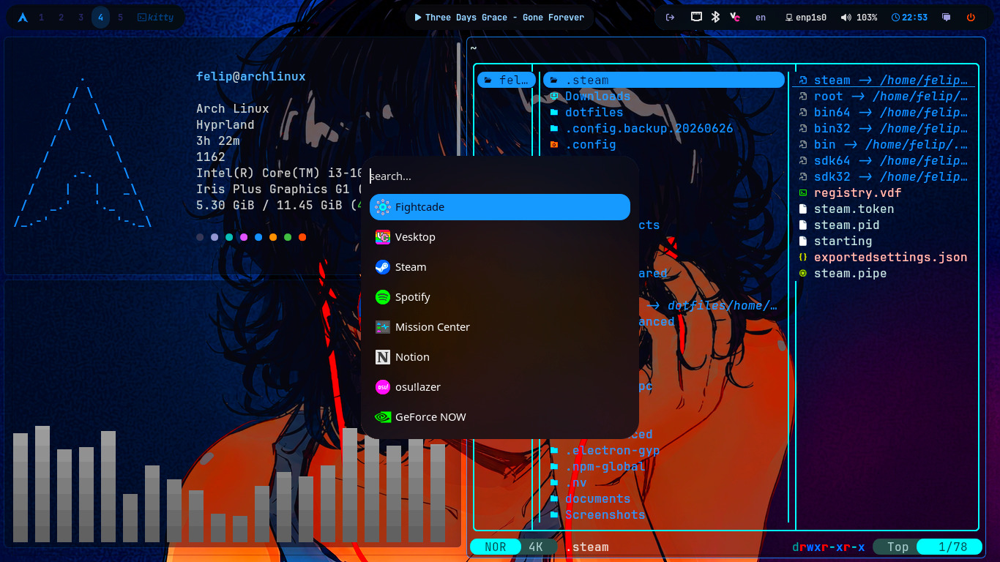

# arch-dotfiles

My personal Arch Linux + Hyprland configuration



> [!NOTE]
> These configs are made for me personally. Use at your own risk.

---

## System Info

| Component | Details |
|-----------|---------|
| OS | Arch Linux |
| WM | Hyprland |
| Bar | Waybar |
| Terminal | Kitty |
| Shell | Bash |
| Launcher | Rofi |
| Notifications | Swaync |
| File Manager | Thunar + Yazi |
| Editor | VSCode |
| Browser | Firefox |
| Music | Spotify |

---

## Installation

```bash
git clone https://github.com/Sandox0/arch-dotfiles.git
cd arch-dotfiles
chmod +x ./install.sh
./install.sh
```

---

## Packages

```bash
# main pkgs
yay -Syu --needed hyprland waybar kitty rofi swaync thunar yazi \
  fastfetch hyprlock hypridle swww cliphist wl-clipboard \
  pavucontrol blueman networkmanager nwg-look

# apps
yay -Syu --needed firefox spotify discord steam visual-studio-code-bin

# fonts & themes
yay -Syu --needed nerd-fonts noto-fonts noto-fonts-emoji \
  papirus-icon-theme bibata-cursor-theme-bin

# optional
yay -Syu --needed obs-studio gpu-screen-recorder cava btop \
  mission-center prismlauncher heroic-games-launcher-bin
```

---

## Extra

**Install Spicetify (Spotify themes):**
```bash
curl -fsSL https://raw.githubusercontent.com/spicetify/cli/main/install.sh | sh
```

**Install Vencord (Discord themes):**
```bash
sh -c "$(curl -sS https://raw.githubusercontent.com/Vendicated/VencordInstaller/main/install.sh)"
```

---

## Screenshots

---

*Made with passion on Arch Linux*
